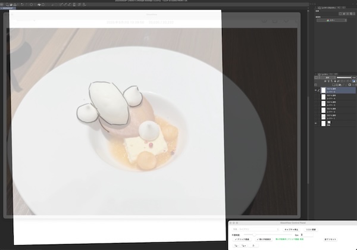

# GlassView

macOS上で特定アプリケーションのウィンドウをリアルタイムでキャプチャし、透過ウィンドウで表示するアプリケーションです。
(アプリケーションそのものを半透明化させるわけではありません)

イラスト制作を支援することを主な目的としています。
ドローイングツールの上に重ねることで、元アプリケーションを操作しながらのトレースや模写がしやすくなります。
例えば以下のようなアプリケーションのキャプチャ画像を重ねると便利です。

- Mac 標準搭載の「写真」アプリ
- 3D モデリングツール(Blender等)
- 動画再生アプリ(Quicktime等)

※動画配信サイト等の、著作権保護技術により保護されているコンテンツはキャプチャできません。

## Demo

ドローイングツールの上に Mac 標準搭載の「写真」アプリのキャプチャ画像を半透明で重ねてトレースする例



<a href="https://storage.googleapis.com/illusts/videos/glassview_demo_f.mp4">デモ動画</a>

## 必要要件

- macOS 12.3以上

## インストール

以下のいずれかの方法で行えます。

### dmg からインストール

[Releases](https://github.com/egawata/glassview/releases) から最新バージョンへのリンクを辿った先の `.dmg` ファイルをダウンロードし、インストールを行ってください。

### ソースコードからビルド

[開発者向け情報](#開発者向け情報)を参照してください。

## 権限設定

初回起動時に、システムから `スクリーン録画` 権限の許可を求められます：

- ダイアログで `システム設定を開く`をクリック
- `GlassView` にチェックを入れる
- アプリケーションを再起動

## 使用方法

### 基本操作

アプリケーションを起動すると、メインウィンドウ（キャプチャ表示用）と**コントロールパネル**（操作用）の2つのウィンドウが表示されます。

**コントロールパネルでの操作:**
- **ウィンドウ選択プルダウン**: キャプチャ対象のウィンドウを選択します
- **キャプチャ開始/停止**: キャプチャ中は元のウィンドウの表示内容がリアルタイムに反映されます
- **リスト更新**: 表示できるウィンドウのリストを更新します
- **不透明度**: メインウィンドウの不透明度を変更します
- **fps**: 更新頻度を調整します。値が大きいほどリアルタイム性が増しますが、CPU負荷が上がります
- **クリック透過**: メインウィンドウがマウス操作に反応せず、背後のアプリケーションに伝わるようになります
- **常に手前表示**: メインウィンドウが常に最前面に表示されます
- **全てリセット**: すべての設定を初期値にリセットします

**コントロールパネルの特徴:**
- コントロールパネルは不透明度やクリック透過の設定に影響されません
- 常に操作可能な状態を保ち、設定変更やアプリケーション制御が可能です
- 「常に手前表示」の設定はコントロールパネルにも適用されます

### メニュー操作

デスクトップ最上部のアイコンからメニューにアクセスできます。

- **全てリセット**: クリック透過、最前面表示、不透明度の変更がすべてリセットされます。
   - 設定を変更しすぎてウィンドウの操作が難しくなったときに使用してください
- **常に手前に表示**: 最前面表示の有効/無効を切り替えます
- **クリック透過**: クリック透過の有効/無効を切り替えます
- **不透明度リセット**: 不透明度を100%にリセットします

### キーボード操作

- **拡大縮小**: `Shift` キーを押しながらマウスホイールを操作
- **移動**: `Space` キーを押しながらマウス左ドラッグ


## トラブルシューティング

### CPU 負荷が高い、なんかマシンの動作が重い

- 画面更新の頻度を下げることで負荷が下がります。
- fps を下げてみてください。たいていの用途では 5fps 以下で十分なはずです。
- 画面更新が必要なければ、キャプチャ開始後に `キャプチャ停止` を押して画面更新を止めてください。

### 起動すると毎回権限の許可を求められ、ウィンドウ一覧を取得できない

- macOS の `システム設定` → `プライバシーとセキュリティ` → `画面収録とシステムオーディオ録音` を開きます
- `GlassView` がすでに存在する場合は削除します。
    - オフにするのではなく `-` ボタンで項目自体を削除
- `+` ボタンをクリックします
- アプリケーションの場所を指定します
    - 通常は `アプリケーション` → `GlassView`


## 開発者向け情報

機能を追加・修正した場合は、以下の手順でアプリケーションを更新してください：

```bash
# 1. Build
swift build

# for release build
# swift build -c release  # release build

# Or
# xcodebuild -project GlassView.xcodeproj -scheme GlassView -configuration Release clean build

# 2. Stop running process
pkill -f "GlassView"

# 3. update executable
mkdir -p GlassView.app/Contents/MacOS
cp .build/debug/GlassView GlassView.app/Contents/MacOS/

# for release build
#cp .build/release/GlassView GlassView.app/Contents/MacOS/

# 4. Code Sign
codesign --force --sign - --entitlements GlassView/GlassView.entitlements GlassView.app

# 5. (Optional) Reset privilege
tccutil reset ScreenCapture tokyo.egawata.GlassView

# 6. Launch app
open GlassView.app
```

## ライセンス

このプロジェクトはApache License 2.0の下で公開されています。詳細については[LICENSE](LICENSE)ファイルをご覧ください。
